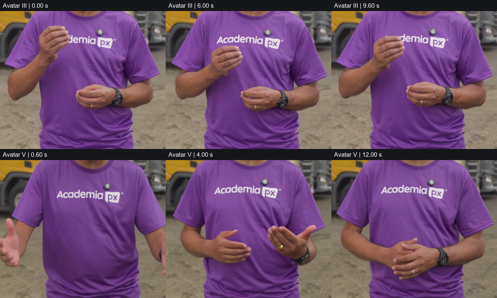
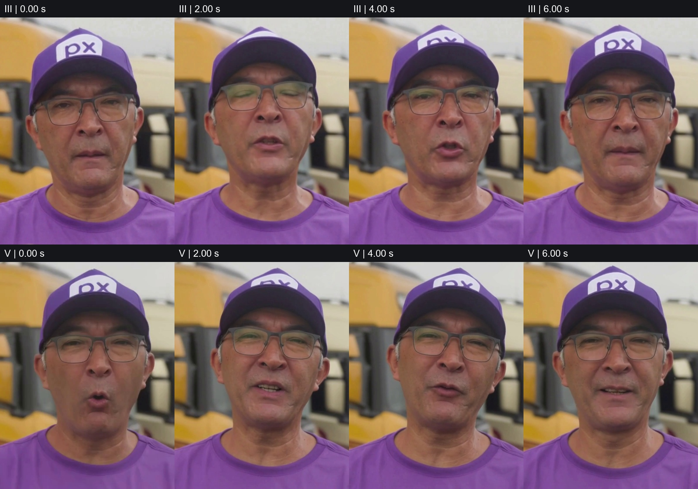

# Análise dos vídeos HeyGen — Avatar III × Avatar V

**Data:** 10/09/2026. **Amostra:** um arquivo identificado como Avatar III e um como Avatar V. A identificação dos modelos vem dos nomes dos arquivos; as configurações de geração não foram fornecidas. Não foi recebido um vídeo do Avatar IV.

**Conclusão:** nesta amostra, o Avatar V apresenta maior variedade de gestos e de expressões visuais. O III apresenta gesticulação mais repetitiva, com recorrência de dedos reunidos e movimentos próximos ao tronco. Não há diferença de resolução ou de taxa de quadros entre os arquivos. A inspeção não sustenta afirmar superioridade geral do V, melhoria percentual de qualidade ou melhor sincronização labial.

**Limite da análise:** não houve escuta. O ambiente recusou a entrada de áudio. Foram feitas inspeção visual por amostragem e medições técnicas do vídeo e do som. Pronúncia, entonação, inteligibilidade, adequação dos gestos ao texto e sincronização entre voz e boca permanecem não avaliadas.

## Comparação visual com evidências

| Aspecto | Avatar III | Avatar V | Conclusão desta amostra |
|---|---|---|---|
| Variedade gestual | Predominam gestos com dedos reunidos, alternando os braços. A postura reaparece em 00:00, 00:06 e 00:09,60. | Abre os braços e as mãos em 00:00,40–00:00,80; posiciona as mãos paralelas em 00:01,40–00:02,40; apresenta uma palma para cima em 00:03,60–00:04,20; une as mãos no trecho final. | V apresenta repertório gestual mais variado. Repetir uma postura não demonstra repetição idêntica de quadros nem constitui, por si só, falha técnica. |
| Expressão facial | Expressão predominantemente sóbria; há variação de boca e momentos de sorriso, inclusive perto de 00:07,40. | Alterna expressão neutra, sorriso e inclinação lateral da cabeça, como em 00:02, 00:04 e 00:06. | Leve vantagem visual do V em expressividade. Sem escuta, não é possível avaliar se a expressão combina melhor com a mensagem. |
| Comportamento no final | Continua alternando gestos até perto do término. | Mantém as mãos unidas aproximadamente de 00:11,80 a 00:15,00, com pequenas variações de cabeça e rosto. | O V não se movimenta mais durante todo o vídeo; a maior variedade é mais evidente no início. A posição de repouso não equivale a congelamento. |
| Consistência de aparência | Boné, óculos, camisa roxa, relógio e anel permanecem reconhecíveis nos quadros inspecionados. | Os mesmos elementos permanecem reconhecíveis nos quadros inspecionados. | Não identifiquei troca grosseira de aparência na amostra visual. A fidelidade exata à pessoa e à roupa originais exige a referência de criação. |
| Marca e cenário | A inscrição “Academia px” e a marca no boné continuam identificáveis quando visíveis; os caminhões permanecem no cenário. | As inscrições também continuam identificáveis quando visíveis; os caminhões permanecem no cenário. | Sem vantagem clara. A deformação de tecido em movimento não foi classificada automaticamente como erro de logotipo. Não houve comparação com a arte original. |
| Definição do rosto | Contornos de óculos, textura da pele e detalhes do boné são visíveis nos recortes extraídos do arquivo original. | Esses detalhes também são visíveis nos recortes extraídos do arquivo original. | A inspeção dos recortes não mostra vantagem inequívoca de nitidez. Ter saída em 2160p não comprova o nível de detalhe da geração original. |
| Boca e mãos | As sequências mostram mudança de posição da boca e gestos reconhecíveis. | As sequências mostram mudança de posição da boca e gestos reconhecíveis. | Não classifiquei posições isoladas da boca como erro de sincronização. A amostragem não permite certificar ausência de defeitos entre quadros. |

*Acima: recortes dos arquivos originais. No III, exemplos de recorrência da mesma família de gestos. No V, exemplos de três posições distintas. Os tempos não representam necessariamente a mesma palavra ou frase nos dois vídeos.*

*Acima: o mesmo retângulo de recorte nos dois arquivos, em 00:00, 00:02, 00:04 e 00:06. A cabeça se desloca dentro do enquadramento. Os recortes foram reduzidos apenas para compor a prancha, sem retoque ou melhoria de imagem.*

## Métricas verificadas

| Medida | Avatar III | Avatar V | Interpretação |
|---|---:|---:|---|
| Resolução do arquivo | 2160 × 3840 | 2160 × 3840 | Mesmo formato vertical 9:16. |
| Taxa de quadros | 25 fps | 25 fps | Mesma cadência nominal. |
| Quadros de vídeo decodificados | 360 | 376 | Todos os quadros foram processados tecnicamente. |
| Duração da trilha de vídeo | 14,40 s | 15,04 s | V tem 0,64 s a mais. Isso não é indicador de qualidade. |
| Duração do contêiner, arredondada pelo leitor | 14,42 s | 15,06 s | Pequena diferença em relação à trilha de vídeo por temporização das trilhas. |
| Tamanho, em MB decimais | 36,43 MB | 37,98 MB | O tamanho maior acompanha a duração maior. |
| Codec de vídeo | H.264 Main | H.264 Main | Mesmo codec e perfil declarados. |
| Bitrate aproximado da trilha de vídeo | 20,104 Mb/s | 20,067 Mb/s | Diferença pequena, sem evidência de vantagem de qualidade. |
| Erros reportados na decodificação do vídeo | 0 | 0 | Os dois arquivos puderam ser decodificados integralmente. |
| Pares consecutivos de quadros exatamente iguais na versão de análise | 0 | 0 | Teste em escala de cinza a 216 × 384; não mede naturalidade nem descarta quase congelamentos. |
| Quadros examinados visualmente na sequência principal | 72 | 76 | Um quadro a cada 0,20 s, com inspeções adicionais de detalhes. |
| Áudio original | AAC, 48 kHz, estéreo | AAC, 48 kHz, estéreo | Mesma configuração básica. |
| Loudness integrado medido | −18,4 LUFS | −19,3 LUFS | III mede 0,9 LU acima do V; não é nota de qualidade de voz. |
| Pico verdadeiro medido, arredondado | −4,3 dBTP | −4,3 dBTP | Nenhum ultrapassa 0 dBTP; isso não comprova ausência de ruído ou de distorção anterior. |

As faixas de áudio decodificadas não são idênticas. Isso não permite concluir que os roteiros são diferentes, mas impede tratar os dois arquivos como um teste com exatamente o mesmo áudio. O enquadramento e a escala corporal também variam. Sem o projeto e as referências, essas diferenças não podem ser atribuídas exclusivamente ao motor de avatar.

## O que pode ser levado ao comitê

> Na comparação dos dois arquivos recebidos, o Avatar V mostrou maior variedade de gestos e expressões visuais, enquanto o III repetiu mais a postura das mãos. Os dois têm a mesma resolução e taxa de quadros, e não apresentaram erros de decodificação. A vantagem observada do V está na apresentação visual desta amostra; sincronização labial, qualidade percebida da voz e ganho geral de qualidade não foram validados.

Para uma decisão restrita à apresentação visual destes arquivos, minha preferência é o V, principalmente pela variedade de gestos do início. Essa preferência não constitui aprovação audiovisual completa. Não foram calculados percentual de melhoria, taxa de retrabalho ou falhas por minuto: faltam uma amostra de produção, registros de aprovação e uma revisão audiovisual integral para sustentar esses indicadores. Também não foi atribuída uma nota geral que misture critérios avaliados com critérios pendentes.

## Método e rastreabilidade

- Leitura local dos dois MP4 e extração com FFmpeg 7.1.
- Decodificação integral de 736 quadros para verificações técnicas. Isso é diferente de inspeção visual de todos os quadros.
- Inspeção visual de 148 quadros espaçados em 0,20 s, organizados cronologicamente, além de 16 recortes faciais e uma prancha de seis detalhes gestuais extraídos em resolução original.
- Leitura visual por um único avaliador de IA, sem painel humano, sem reprodução audiovisual com escuta e sem acesso às referências de criação.
- Medição do áudio estéreo original com o filtro ebur128. A comparação de igualdade das faixas usou PCM mono a 16 kHz; não foi usada como indicador de inteligibilidade ou de lip sync.
- As pranchas exibem amostras e não certificam ausência de artefatos de curta duração.

Arquivos de origem:

- `C:\Users\AlexandreMachado\Downloads\Heygen - Avatar III_2160p.mp4` — SHA-256: `1b37785256120d46bfa9d4cb53001d2de43dc65d074c6f79e683a5da19021ebe`.
- `C:\Users\AlexandreMachado\Downloads\Heygen - Avatar V_2160p.mp4` — SHA-256: `44ddd5fa21cfa919c3165202873743b300d473e60fcead2adcea6d2440384232`.

## Atualização: roteiro e MP3 — 10/09/2026

Roteiro lido integralmente em `Heygen - Avatar III.xlsx`, Sheet1!A1:A3:

1. Olá, motorista!
2. Boas-vindas a este treinamento desenvolvido pela Academia PX.
3. Este conteúdo foi preparado para apoiar você, motorista profissional autônomo, que realiza prestação de serviços em operações de transporte.

Transcrição automática local (faster-whisper small, português, CPU int8, beam size 5, sem fornecer o roteiro): as sequências de palavras de III e V correspondem ao roteiro após desconsiderar pontuação e maiúsculas. Não é avaliação perceptiva de pronúncia ou voz.

| MP3 | Duração decodificada | Loudness integrado | Pico verdadeiro |
|---|---:|---:|---:|
| III | 14,40 s | −18,8 LUFS | −4,6 dBTP |
| V | 15,04 s | −19,7 LUFS | −4,7 dBTP |

Medição uniforme por FFmpeg 7.1, filtro ebur128. Os MP3 são estéreo, 48 kHz, 128 kb/s. Sinal fortemente correspondente ao respectivo MP4 (correlação > 0,999 após alinhamento), com redução aproximada de 0,44 dB. As medições de loudness dos MP4 anteriores continuam identificadas como originais; não misturar as bases.

A landing page foi refeita com gráficos de duração e loudness, tabela de diferenças, três momentos gestuais, players incorporados, roteiro e método expansível. Os vídeos incorporados são prévias comprimidas em 540 × 960; os MP3 incorporados são os arquivos recebidos sem alteração. A análise visual continua baseada nos originais.

A versão V3 acrescenta prévias silenciosas na abertura, transições com profundidade, ampliação das evidências e linha do tempo interativa das três falas. Os intervalos da linha do tempo são estimados pela transcrição; os botões reproduzem cada trecho do MP3 e interrompem ao fim do intervalo.
